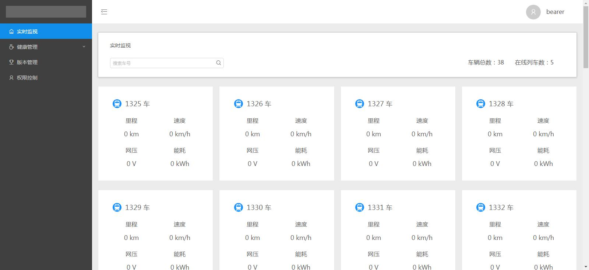
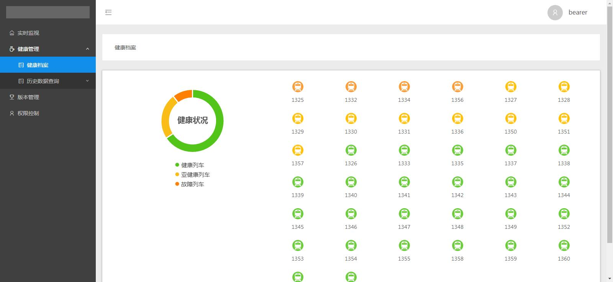
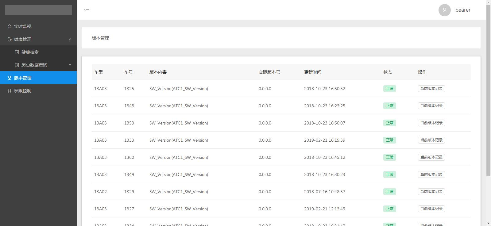
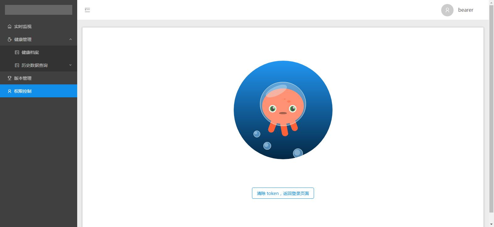

This project was bootstrapped with [Create React App](https://github.com/facebook/create-react-app).

## 相关技术

react@15.3.2 + redux@3.6.0 + react-router + axios@0.19.0 + websocket@1.0.29 + antd@2.7.2 + echarts@4.2.1

### 如何运行

npm install

npm start

访问 localhost:3000

### 截图

### 登录

### 实时监视

### 健康管理

### 版本管理

### 权限控制

